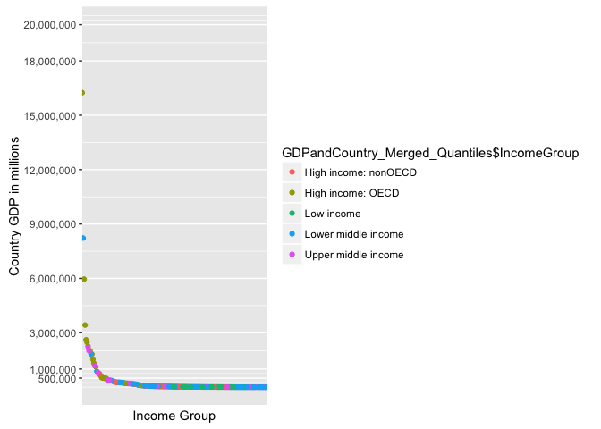

# Unit6 Case Study Assignment
Aravind Veluchamy  
June 21, 2016  
##This Case Study offers a glimpse into how the GDP Ranking of a country based on GDP Dollar Value in Millions stacks up against the Per capita income which is indiacted by the Income Group. The purpose of the case study is to do a preliminary investigation on relationship between GDP Value(from Rank) and Income group(Income per capita).The data has been obtained from world bank.
###The following  code chunk explains the downloading the GDP and Country data that was used in the study
###Loading Required Libraries

```r
library(downloader)
library(scales)
library(ggplot2)
```
###Downloading the data sets

```r
download("https://d396qusza40orc.cloudfront.net/getdata%2Fdata%2FGDP.csv ",destfile = "GDP.csv")
download("https://d396qusza40orc.cloudfront.net/getdata%2Fdata%2FEDSTATS_Country.csv  ",destfile = "country.csv")
GDPdata <- read.csv("GDP.csv",stringsAsFactors = FALSE,header=FALSE)
Country <- read.csv("country.csv",stringsAsFactors = FALSE,header=FALSE)
head(GDPdata)
```

```
##    V1                          V2 V3            V4           V5 V6 V7 V8
## 1     Gross domestic product 2012 NA                               NA NA
## 2                                 NA                               NA NA
## 3                                 NA               (millions of    NA NA
## 4                         Ranking NA       Economy  US dollars)    NA NA
## 5                                 NA                               NA NA
## 6 USA                           1 NA United States  16,244,600     NA NA
##   V9 V10
## 1 NA  NA
## 2 NA  NA
## 3 NA  NA
## 4 NA  NA
## 5 NA  NA
## 6 NA  NA
```

```r
str(GDPdata)
```

```
## 'data.frame':	331 obs. of  10 variables:
##  $ V1 : chr  "" "" "" "" ...
##  $ V2 : chr  "Gross domestic product 2012" "" "" "Ranking" ...
##  $ V3 : logi  NA NA NA NA NA NA ...
##  $ V4 : chr  "" "" "" "Economy" ...
##  $ V5 : chr  "" "" "(millions of" "US dollars)" ...
##  $ V6 : chr  "" "" "" "" ...
##  $ V7 : logi  NA NA NA NA NA NA ...
##  $ V8 : logi  NA NA NA NA NA NA ...
##  $ V9 : logi  NA NA NA NA NA NA ...
##  $ V10: logi  NA NA NA NA NA NA ...
```

```r
head(Country)
```

```
##            V1                           V2                   V3
## 1 CountryCode                    Long Name         Income Group
## 2         ABW                        Aruba High income: nonOECD
## 3         ADO      Principality of Andorra High income: nonOECD
## 4         AFG Islamic State of Afghanistan           Low income
## 5         AGO  People's Republic of Angola  Lower middle income
## 6         ALB          Republic of Albania  Upper middle income
##                          V4               V5           V6             V7
## 1                    Region Lending category Other groups  Currency Unit
## 2 Latin America & Caribbean                                Aruban florin
## 3     Europe & Central Asia                                         Euro
## 4                South Asia              IDA         HIPC Afghan afghani
## 5        Sub-Saharan Africa              IDA              Angolan kwanza
## 6     Europe & Central Asia             IBRD                Albanian lek
##                         V8                       V9
## 1 Latest population census  Latest household survey
## 2                     2000                         
## 3           Register based                         
## 4                     1979               MICS, 2003
## 5                     1970 MICS, 2001, MIS, 2006/07
## 6                     2001               MICS, 2005
##                                                                           V10
## 1                                                               Special Notes
## 2                                                                            
## 3                                                                            
## 4 Fiscal year end: March 20; reporting period for national accounts data: FY.
## 5                                                                            
## 6                                                                            
##                           V11                              V12
## 1 National accounts base year National accounts reference year
## 2                        1995                                 
## 3                                                             
## 4                   2002/2003                                 
## 5                        1997                                 
## 6                                                         1996
##                           V13                 V14
## 1 System of National Accounts SNA price valuation
## 2                                                
## 3                                                
## 4                                             VAB
## 5                                             VAP
## 6                        1993                 VAB
##                             V15             V16
## 1 Alternative conversion factor PPP survey year
## 2                                              
## 3                                              
## 4                                              
## 5                       1991-96            2005
## 6                                          2005
##                                 V17                            V18
## 1 Balance of Payments Manual in use External debt Reporting status
## 2                                                                 
## 3                                                                 
## 4                                                           Actual
## 5                              BPM5                         Actual
## 6                              BPM5                         Actual
##               V19                           V20
## 1 System of trade Government Accounting concept
## 2         Special                              
## 3         General                              
## 4         General                  Consolidated
## 5         Special                              
## 6         General                  Consolidated
##                               V21
## 1 IMF data dissemination standard
## 2                                
## 3                                
## 4                            GDDS
## 5                            GDDS
## 6                            GDDS
##                                                 V22
## 1 Source of most recent Income and expenditure data
## 2                                                  
## 3                                                  
## 4                                                  
## 5                                         IHS, 2000
## 6                                        LSMS, 2005
##                           V23                        V24
## 1 Vital registration complete Latest agricultural census
## 2                                                       
## 3                         Yes                           
## 4                                                       
## 5                                                1964-65
## 6                         Yes                       1998
##                      V25               V26                          V27
## 1 Latest industrial data Latest trade data Latest water withdrawal data
## 2                                     2008                             
## 3                                     2006                             
## 4                                     2008                         2000
## 5                                     1991                         2000
## 6                   2005              2008                         2000
##            V28       V29         V30         V31
## 1 2-alpha code WB-2 code  Table Name  Short Name
## 2           AW        AW       Aruba       Aruba
## 3           AD        AD     Andorra     Andorra
## 4           AF        AF Afghanistan Afghanistan
## 5           AO        AO      Angola      Angola
## 6           AL        AL     Albania     Albania
```

```r
str(Country)
```

```
## 'data.frame':	235 obs. of  31 variables:
##  $ V1 : chr  "CountryCode" "ABW" "ADO" "AFG" ...
##  $ V2 : chr  "Long Name" "Aruba" "Principality of Andorra" "Islamic State of Afghanistan" ...
##  $ V3 : chr  "Income Group" "High income: nonOECD" "High income: nonOECD" "Low income" ...
##  $ V4 : chr  "Region" "Latin America & Caribbean" "Europe & Central Asia" "South Asia" ...
##  $ V5 : chr  "Lending category" "" "" "IDA" ...
##  $ V6 : chr  "Other groups" "" "" "HIPC" ...
##  $ V7 : chr  "Currency Unit" "Aruban florin" "Euro" "Afghan afghani" ...
##  $ V8 : chr  "Latest population census" "2000" "Register based" "1979" ...
##  $ V9 : chr  "Latest household survey" "" "" "MICS, 2003" ...
##  $ V10: chr  "Special Notes" "" "" "Fiscal year end: March 20; reporting period for national accounts data: FY." ...
##  $ V11: chr  "National accounts base year" "1995" "" "2002/2003" ...
##  $ V12: chr  "National accounts reference year" "" "" "" ...
##  $ V13: chr  "System of National Accounts" "" "" "" ...
##  $ V14: chr  "SNA price valuation" "" "" "VAB" ...
##  $ V15: chr  "Alternative conversion factor" "" "" "" ...
##  $ V16: chr  "PPP survey year" "" "" "" ...
##  $ V17: chr  "Balance of Payments Manual in use" "" "" "" ...
##  $ V18: chr  "External debt Reporting status" "" "" "Actual" ...
##  $ V19: chr  "System of trade" "Special" "General" "General" ...
##  $ V20: chr  "Government Accounting concept" "" "" "Consolidated" ...
##  $ V21: chr  "IMF data dissemination standard" "" "" "GDDS" ...
##  $ V22: chr  "Source of most recent Income and expenditure data" "" "" "" ...
##  $ V23: chr  "Vital registration complete" "" "Yes" "" ...
##  $ V24: chr  "Latest agricultural census" "" "" "" ...
##  $ V25: chr  "Latest industrial data" "" "" "" ...
##  $ V26: chr  "Latest trade data" "2008" "2006" "2008" ...
##  $ V27: chr  "Latest water withdrawal data" "" "" "2000" ...
##  $ V28: chr  "2-alpha code" "AW" "AD" "AF" ...
##  $ V29: chr  "WB-2 code" "AW" "AD" "AF" ...
##  $ V30: chr  "Table Name" "Aruba" "Andorra" "Afghanistan" ...
##  $ V31: chr  "Short Name" "Aruba" "Andorra" "Afghanistan" ...
```

### The following code chunk explains cleaning the GDPdata and Country datasets and assigning Column Headers.

```r
GDPdata <- GDPdata[-c(1,2,3,4,5),]
GDPdata <- GDPdata[,-c(3,6,7,8,9,10)]
names(GDPdata) <-c("CountryCode","Rank","Country","DollarValue")
NoRank <- which(GDPdata$Rank=="")
GDPdata <-GDPdata[(-1*NoRank),]
NoDollarvalue <- which(GDPdata$DollarValue=="")
GDPdata <-GDPdata[(-1*NoDollarvalue),]
Country <- Country[,-c(10:31)]
Country <-Country[-c(1),]
names(Country) <-c("CountryCode" , "CountryName" , "IncomeGroup" , "Region" , "LendingCategory" , "OtherGroups" , "CurrencyUnit" , "LatestPopulationCensus" , "LatestHouseholdSurvey" )
```
###1.Merging Country and GDP data sets and number of records after merging is 189.

```r
GDPandCountry_Merged<- merge(GDPdata,Country,by ="CountryCode")
str(GDPandCountry_Merged)
```

```
## 'data.frame':	189 obs. of  12 variables:
##  $ CountryCode           : chr  "ABW" "AFG" "AGO" "ALB" ...
##  $ Rank                  : chr  "161" "105" "60" "125" ...
##  $ Country               : chr  "Aruba" "Afghanistan" "Angola" "Albania" ...
##  $ DollarValue           : chr  " 2,584 " " 20,497 " " 114,147 " " 12,648 " ...
##  $ CountryName           : chr  "Aruba" "Islamic State of Afghanistan" "People's Republic of Angola" "Republic of Albania" ...
##  $ IncomeGroup           : chr  "High income: nonOECD" "Low income" "Lower middle income" "Upper middle income" ...
##  $ Region                : chr  "Latin America & Caribbean" "South Asia" "Sub-Saharan Africa" "Europe & Central Asia" ...
##  $ LendingCategory       : chr  "" "IDA" "IDA" "IBRD" ...
##  $ OtherGroups           : chr  "" "HIPC" "" "" ...
##  $ CurrencyUnit          : chr  "Aruban florin" "Afghan afghani" "Angolan kwanza" "Albanian lek" ...
##  $ LatestPopulationCensus: chr  "2000" "1979" "1970" "2001" ...
##  $ LatestHouseholdSurvey : chr  "" "MICS, 2003" "MICS, 2001, MIS, 2006/07" "MICS, 2005" ...
```
###2.Sorting Merged data set by Rank and display the 13th country in Ascending order(US must be last).
####The 13th country in descending order is St.Kitts and Nevis.The original question was to sort data in ascending order ,but it was also mentioned that US should be last.Therefore I sorted the data in Descending order.

```r
GDPandCountry_Merged_sorted_Asc <- GDPandCountry_Merged
GDPandCountry_Merged_sorted_Asc <- transform(GDPandCountry_Merged_sorted_Asc,Rank=as.character(Rank))
GDPandCountry_Merged_sorted_Asc <- transform(GDPandCountry_Merged_sorted_Asc,Rank=as.integer(Rank))
GDPandCountry_Merged_sorted_Asc <-GDPandCountry_Merged_sorted_Asc[order(GDPandCountry_Merged_sorted_Asc$Rank,decreasing = TRUE),]
GDPandCountry_Merged_sorted_Asc[c(13),]
```

```
##    CountryCode Rank             Country DollarValue         CountryName
## 93         KNA  178 St. Kitts and Nevis        767  St. Kitts and Nevis
##            IncomeGroup                    Region LendingCategory
## 93 Upper middle income Latin America & Caribbean            IBRD
##    OtherGroups          CurrencyUnit LatestPopulationCensus
## 93             East Caribbean dollar                   2001
##    LatestHouseholdSurvey
## 93
```
###3.What are the average GDP rankings for the "High income: OECD" and "High income: nonOECD" groups?
####The merged data set was divided into Highincome.NonOECD and Highincome.OECD using the subset function.The mean function was on the Rank column to obtain the Avg rankings for these two groups.

```r
Highincome.NonOECD <-subset(GDPandCountry_Merged,GDPandCountry_Merged$IncomeGroup=="High income: nonOECD")
Highincome.NonOECD <-transform(Highincome.NonOECD,Rank=as.character(Rank))
 Highincome.NonOECD <-transform(Highincome.NonOECD,Rank=as.integer(Rank))
mean(Highincome.NonOECD$Rank)
```

```
## [1] 91.91304
```

```r
Highincome.OECD <-subset(GDPandCountry_Merged,GDPandCountry_Merged$IncomeGroup=="High income: OECD")
Highincome.OECD <-transform(Highincome.OECD,Rank=as.character(Rank))
 Highincome.OECD <-transform(Highincome.OECD,Rank=as.integer(Rank))
mean(Highincome.OECD$Rank)
```

```
## [1] 32.96667
```
###5.Cut the GDP ranking into 5 separate quantile groups. Make a table versus Income.Group. How many countries are Lower middle income but among the 38 nations with highest GDP?
####Firstly the Rank Column is converted into an integer type and then Dollar value undergoes a similar transformation.
####Eventhough Dollar Value is not used in this chunk the transformation is carried for plot function used in next chunk.
####Next the quantiles are plotted as 5 quantile groups.This is exactly how the data needs to cut in the next statement.
####Use the cut function to cut the data into five quantile groups and add a seperate column to capture the quantile group data falls into
####Plot a table of Income vs Group(represented by quantile range column)

```r
GDPandCountry_Merged_Quantiles <- GDPandCountry_Merged
GDPandCountry_Merged_Quantiles$Rank <- as.character(GDPandCountry_Merged_Quantiles$Rank)
GDPandCountry_Merged_Quantiles$Rank <- as.integer(GDPandCountry_Merged_Quantiles$Rank)
GDPandCountry_Merged_Quantiles$DollarValue = (gsub(",","",GDPandCountry_Merged_Quantiles$DollarValue))
GDPandCountry_Merged_Quantiles$DollarValue <- as.character(GDPandCountry_Merged_Quantiles$DollarValue)
GDPandCountry_Merged_Quantiles$DollarValue <- as.integer(GDPandCountry_Merged_Quantiles$DollarValue)
quantile(GDPandCountry_Merged_Quantiles$Rank,probs=seq(0,1,0.2))
```

```
##    0%   20%   40%   60%   80%  100% 
##   1.0  38.6  76.2 113.8 152.4 190.0
```

```r
GDPandCountry_Merged_Quantiles$QuantilesRange <- with(GDPandCountry_Merged_Quantiles,cut(GDPandCountry_Merged_Quantiles$Rank,breaks=quantile(GDPandCountry_Merged_Quantiles$Rank,probs=seq(0,1,by=0.2),na.rm=TRUE),include.lowest=TRUE))
Quantile <- table(GDPandCountry_Merged_Quantiles$IncomeGroup,GDPandCountry_Merged_Quantiles$QuantilesRange)
Quantile
```

```
##                       
##                        [1,38.6] (38.6,76.2] (76.2,114] (114,152] (152,190]
##   High income: nonOECD        4           5          8         4         2
##   High income: OECD          18          10          1         1         0
##   Low income                  0           1          9        16        11
##   Lower middle income         5          13         11         9        16
##   Upper middle income        11           9          8         8         9
```
###4.Plot the GDP for all of the countries. Use ggplot2 to color your plot by Income Group.
###Use the qplot function and then use the scale_y_continous to display the scales in numbers instead of exponential values

```r
CountryGDPinMils <- qplot(GDPandCountry_Merged_Quantiles$Rank,GDPandCountry_Merged_Quantiles$DollarValue,data=GDPandCountry_Merged_Quantiles,color=GDPandCountry_Merged_Quantiles$IncomeGroup)
CountryGDPinMils + scale_y_continuous(name="Country GDP in millions",labels=comma,limits=c(2,20000000),breaks=c(500000,1000000,3000000,6000000,9000000,12000000,15000000,18000000,20000000))+scale_x_discrete(name="Income Group",labels=c("High income: nonOECD","High income: OECD", "Low income","Lower middle income","Upper middle income"))
```

<!-- -->
###Conclusion
####The GDP of a country alone is not a measure of Country's advancement or Quality of Life.Even though the country might have a High GDP it does not mean the population is having a good quality of life as the wealth might only benifit a certain section of society.
